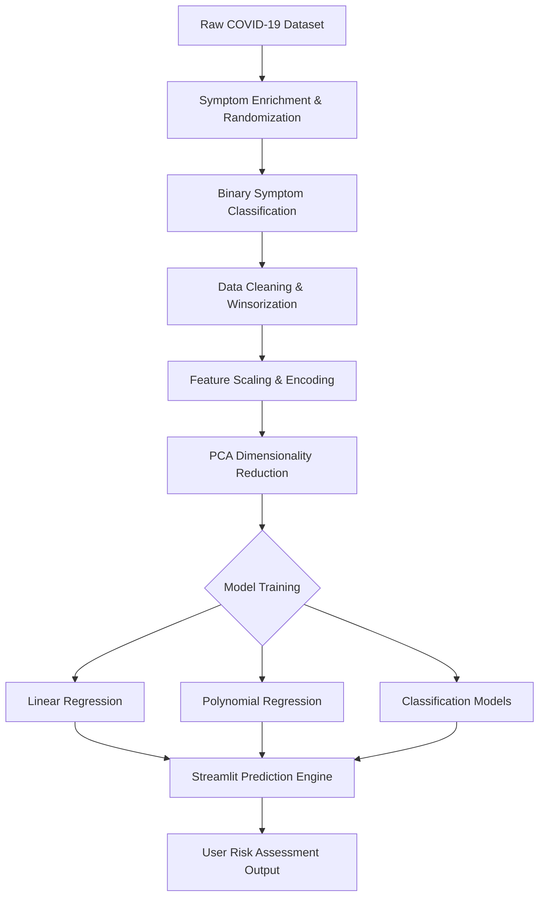

# COVID-19 Analysis & Death Risk Predictor


## Project Overview
This project provides a comprehensive analytical framework for investigating COVID-19 trends, symptom prevalence, and predictive modeling for mortality risk. Utilizing advanced data enrichment techniques and machine learning algorithms, the system estimates the "Deaths per Million" and risk levels based on clinical symptom profiles across various global locations.

### Group Members
*   **M. Ezaz Azhar** | 23FA-036-SE
*   **Muhammad Affan** | 23FA-003-SE
*   **Huzaifa Ashrafi** | 23FA-035-SE

---

## Key Features

### Symptom Data Enrichment
Simulates real-world variability by dynamically assigning 6–7 unique symptoms to each observation. This transformation converts raw text entries into a structured binary matrix (1: Present, 0: Absent), enabling fine-grained statistical analysis.

### Advanced Visual Analytics
- **Symptom Word Cloud**: Real-time visualization of symptom frequency, highlighting dominant markers like *fever*, *cough*, and *fatigue*.
- **Distribution Analysis**: Automated KDE and Histogram generation for all numerical features to detect skewness and data patterns.

### Robust Preprocessing Pipeline
- **Outlier Capping (Winsorization)**: Instead of data loss, extreme values are capped using the Interquartile Range (IQR) method, ensuring model stability while retaining data volume.
- **Dimensionality Reduction (PCA)**: Principal Component Analysis is employed to retain **95% of original variance**, reducing noise and optimizing computational efficiency.
- **Categorical Encoding**: One-Hot Encoding for location data ensures regional nuances are captured without introducing ordinal bias.

---

## System Architecture



---

## Technical Performance

The models demonstrate high predictive fidelity, with the Polynomial model capturing complex non-linear relationships effectively.

| Metric | Linear Regression | Polynomial Regression (Deg 2) |
| :--- | :---: | :---: |
| **R² Score** | **0.9245** | **0.9883** |
| **MSE** | 8.0778 | 1.2479 |
| **MAE** | 2.0863 | 0.7345 |
| **SSE** | 1510.5 | 233.37 |

> [!NOTE]
> PCA reduced the feature space from 20+ dimensions to **8 principal components** while maintaining 95% of the information, significantly improving inference speed in the deployment environment.

---

## Tech Stack & Tools

- **Core**: `Python 3.9+`
- **Data Manipulation**: `Pandas`, `NumPy`
- **Visualization**: `Matplotlib`, `Seaborn`, `WordCloud`
- **Machine Learning**: `Scikit-Learn` (Linear/Poly Regression, PCA, Scalers, Metrics)
- **Deployment**: `Streamlit`, `Joblib`

---

## Quick Start

### 1. Prerequisites
Ensure you have Python installed. We recommend using a virtual environment.

### 2. Installation
```bash
# Clone the repository
git clone https://github.com/HuzaifaAshrafi1/COVID19-ML-Prediction.git
cd COVID19-ML-Prediction

# Install dependencies
pip install -r requirements.txt
```

### 3. Running the Analysis
To view the EDA and model training process:
```bash
jupyter notebook scripts/COVID\ 19\ Analysis,ML\ &\ Models.ipynb
```

### 4. Launching the Web App
Execute the Streamlit application to start making real-time predictions:
```bash
python -m streamlit run scripts/PredictionApp.py
```

---

## Project Structure

```text
COVID19-ML-Prediction/
├── data/
│   ├── Actual Data of COVID-19.csv   # Raw source data
│   └── Cleaned Data of Covid-19.csv  # Processed dataset
├── models/
│   ├── linear_regression_model.pkl   # Serialized Linear Model
│   └── *.pkl                        # Other trained variants
├── scripts/
│   ├── PredictionApp.py              # Streamlit frontend logic
│   └── Analysis_Notebook.ipynb       # Core research & modeling
├── visuals/                          # Exported plots & charts
├── requirements.txt                  # Dependency manifest
```

---

## Usage Instructions

1.  **Select Prediction Mode**: Toggle between *Regression* (Numeric Prediction) and *Classification* (Risk Level).
2.  **Input Symptoms**: Check the boxes for symptoms the user is experiencing (Fever, Cough, etc.).
3.  **Regional Data**: Provide current cases per million for your specific location.
4.  **Result Interpretation**:
    *   **High Risk**: Needs urgent clinical attention.
    *   **Low/Moderate Risk**: Monitor symptoms and maintain isolation.

---

## Future Roadmap
- Integration of Real-time WHO API for live global stats.
- LSTM integration for time-series forecasting of death trends.
- Multi-language support for the Prediction Engine.

---

## License
This project is licensed under the MIT License - see the [LICENSE](LICENSE) file for details.

---

## Contact Info
For inquiries or collaborations, please contact:
- **M. Ezaz Azhar**: [ezaz.azhar@gmail.com](mailto:ezaz.azhar@gmail.com) | [Ezaz Azhar](https://www.linkedin.com/in/ezaz-azhar-1a6394384/)
- **Muhammad Affan**: [maffan2830@gmail.com](mailto:maffan2830@gmail.com) | [Affan Nexor](https://www.linkedin.com/in/affan-nexor-66abb8321/)
- **Huzaifa Ashrafi**: [huzaifa123ashrafi@gmail.com](mailto:huzaifa123ashrafi@gmail.com) | [Huzaifa Ashrafi](https://www.linkedin.com/in/huzaifa-ashrafi/)
